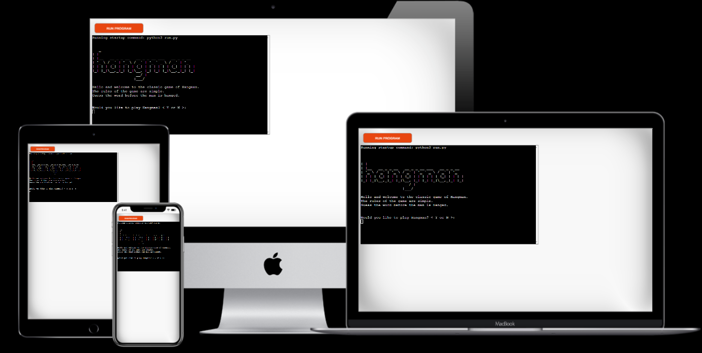
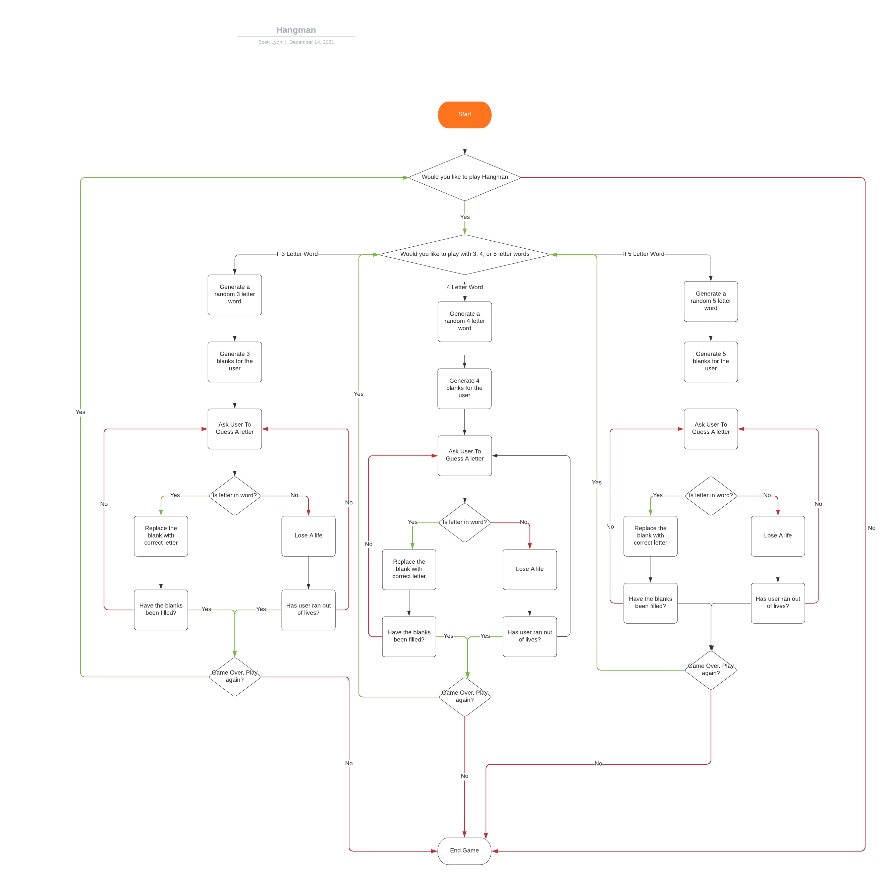
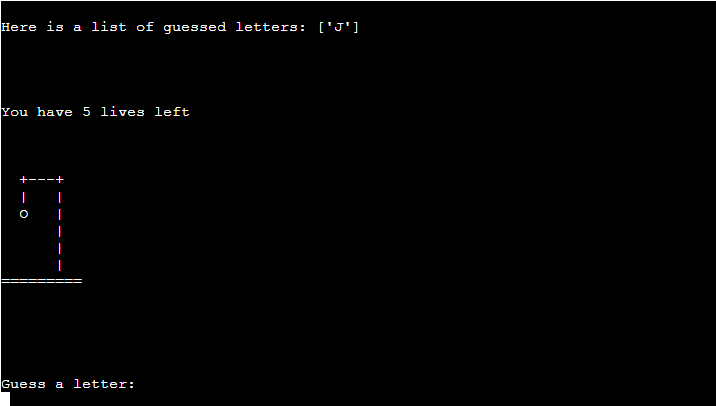
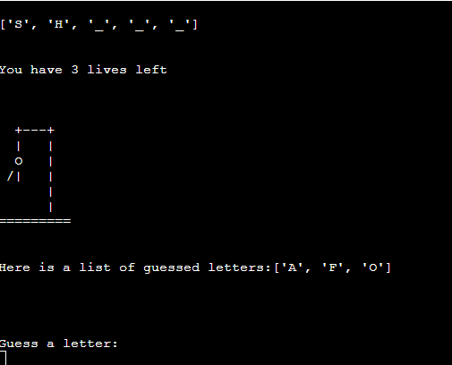
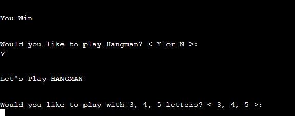
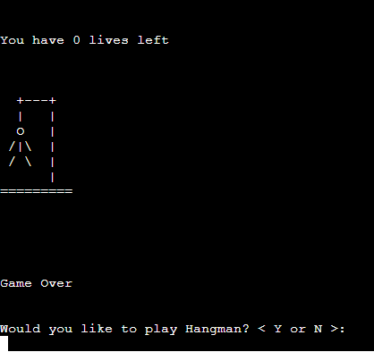
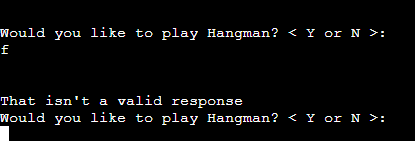
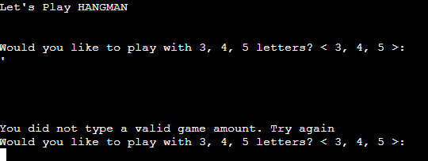
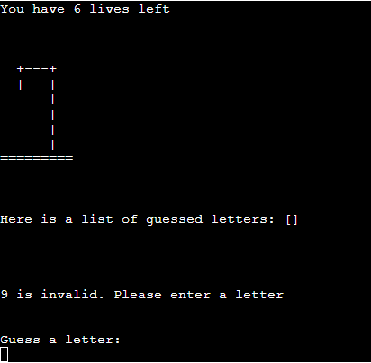
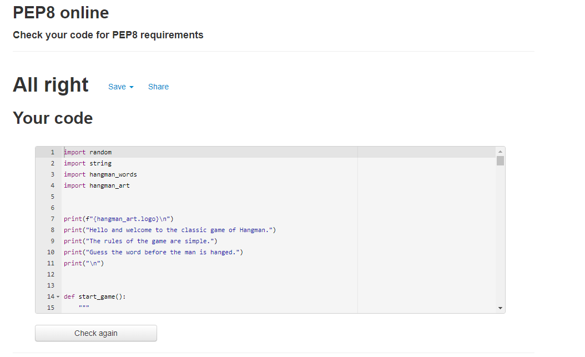

# Hangman

This is a small project written in Python. It is the classic game of Hangman. It is a simple word guessing game in which the user guesses the mystery word, letter-by-letter.

About Hangman -  [Hangman Wikipedia](https://en.wikipedia.org/wiki/Hangman_(game))

Link to the project -  [Hangman - The Game](https://game-of-hang-the-man.herokuapp.com/)

***

## Table of Contents
  * [UX and UI Design](#ux-and-ui-design)
    * [Owner Goals](#owner-goals)
    * [User Goals](#user-goals)
    * [Potential Features to Use](#potential-features-to-use)
    * [Wireframes](#wireframes)
    * [Flow Chart](#flowchart)
  * [Design](#design)
    * [Imagery](#imagery)
  * [Features](#features)
    * [Existing Features](#existing-features)
    * [Features Left To Implement](#features-left-to-implement)
    * [Technologies Used](#technologies-used)
  * [Testing](#testing)
    * [Validator Testing](#validator-testing)
    * [Manual Testing](#manual-testing)
    * [Bugs](#unfixed-bugs)
  * [Deployment](#deployment)
  * [Credits](#credits)
    * [Content](#content)
    * [Media](#media)
    * [Acknowledgments](#acknowledgements)

***

## UX and UI Design

UX and UI Design is limited due to the catch all design for terminal based projects. 

*** 

### Owner Goals

- To deploy a working game of Hangman that validates user input.
- To create a slight variation of the game. To allow for different degrees of difficulty.
- To challenge the user.

***

### User Goals

- Understand the game with ease.
- Option to chose the level of difficulty level of the game.
- Easy to use and navigate.

***

### Wireframes

Due to the game being played within the terminal, I did not use any design wireframes as the design is restricted to that of the terminal.

***

### Flowchart

***

## Design

### Imagery

I used ASCII Art as the imagery within this project.

[ASCII Art Wikipedia](https://en.wikipedia.org/wiki/ASCII_art)

***

## Features

### Existing Features

#### Logo
  
  - The Logo is the word Hangman designed in ASCII Art

 
 ***

#### Menu
  
  - The Menu is loaded, with the logo, in the terminal.
  - It asks the user if they would like to the play the game or not.

***

#### End Game

 - If the user chooses not to play the game. Then we say goodbye to the user and the game will end.

***

#### Play Game

  - If the user chose to play the game, they are then asked if they would like to play with three, four, or a five lettered word.
  - The size of the word is repeated to the user.
  - Then the game begins, asking the user to guess a letter.

***

#### In Game Play (Incorrect)

  - After the user makes inputs a guess, a list of guessed letters is shown to the user. This allows the user to see which letters they have guessed throughout the game. This is displayed if the letter is NOT in the word.

  - The amount of lives left is displayed.

  - The ASCII Art is displayed showcasing the stage of life the user is at.  

***

#### In Game Play (Correct)

  - The word is displayed to the user, with the correct letter displayed in the correct position, to the user.
  - The amount of lives are still displayed to the user.
  - The ASCII Art of the stages of Hangman are displayed.
  - A list of guessed letters is still displayed to the user.
  - Asks the User to guess the next letter.

***

#### Win Game

- If the winner correctly guesses all the letters, "You Win" is displayed to the user.
- The user is asked if they would like to play again.
- If yes, the loop of the game starts again, or it ends if the user inputs no. 

***

#### Lose Game

  - If the user loses the game, they are asked if they would like to play again. If yes, the loop will start again. If not, the game will end.

***

#### User Validation One

  - User Validation 1. If the User inputs anything OTHER than "Y" or "N" then an invalid response is displayed to the user, and they are asked to input again.

***

#### User Validation Two

  - User Validation 2. If the User inputs anything OTHER than "3", "4", or "5" then an invalid response is displayed to the user, and they are asked to input again.

  
***

#### User Validation Three

  - User Validation Three. If the user inputs anything other than a letter, then the lives are displayed to the user, stating a life has not been taken away.
  - The User is told that the input is invalid, and they need to guess again.

  
***

#### Features Left To Implement

  - More sized words! I had a time constraint due to having three weeks to learn Python for this hand-in. If I had more time I would have words varying in different sizes, maybe going up to 10. Allowing for different difficulties.
  - Random word feature. Am additional list where I take all different sized words to produce a more 'traditional' hangman game.
  - Scoreboard. If the user would like to keep playing, allowing a high score feature? Or a score feature that gives higher points the quicker you guess the word.

## Technologies Used

Languages
  - [Python](https://en.wikipedia.org/wiki/Python_(programming_language))

## Technologies Used

  - [GitPod](https://gitpod.io/)
    - The online IDE was used to write the code and testing within the terminal.
  - [Git](https://git-scm.com/)
    - Was used for version control.
  - [GitHub](https://github.com/)
    - As a repository and storing the projects code.
  - [Heroku](https://www.heroku.com/home)
    - Used as deployment for the game.
  - [Lucidchart](https://www.lucidchart.com/pages/)
    - To produce the flowchart of the game's logic.
  
Frameworks and Libraries
 - [Code Institute - Template](https://github.com/Code-Institute-Org/gitpod-full-template)
 - All Python Modules used were the internal Python Libraries/Modules. These were the Random and String Module. 

***

## Testing

### Validator Testing

***

### Manual Testing

The site was manually tested throughout production. Every function, or additional line of code was printed to the terminal to check if the code was running correctly.

I asked several people to be 'beta' testers, who tried their best to completely break the game. I used people who do not code as I believe these people are always the best to test projects on.

***

### Bugs
Line Length on several lines.

This was due to my inexperience using Python and lack of knowledge of line length. This is solved using searching Stack Overflow. The code was shortened by wrapping the code within parenthesis and writing the code on a new line.

Displaying Lives in conjunction with ASCII Art.

I was making simple mistakes. At first I hadn't linked the hangman_words.py file correctly. Secondly, I was trying to chose which type of For Loop would be best to proceed with.

Generating Random Word, and Checking Random Word.

Again, absolute school boy error. I had changed the code within the Four Letter Function (thinking I was changing the code within the Three Letter Function), and I was testing the code by playing Three Letter Word and seeing absolutely no code changes whatsoever! Sometimes just going to boil the kettle for a cup of tea makes a world of difference!

## Deployment
  
### Clone a GitHub repository
To make a local copy of this project you can make a clone by following these steps:
- Log in to GitHub and find the [repository](https://github.com/TotallySly/portfolio_project_three).
- Above the list of files click on the code button. By the https address there is a copy symbol, click on that.
- Open Git Bash
- Change the current working directory to the location where you want the cloned directory.
- Type "git clone", and paste in the copied URL.
- Press Enter to create your local clone.

### Deploy to Heroku
This site was deployed to Heroku Apps. To deploy a site, follow these steps:
- Make sure you have correct requirements.txt and Procfile committed and pushed before moving on with the deployment.
- Log in to [Heroku apps](https://heroku.com/)
- On the Heroku dashboard go to the "New" menu and choose "Create new app".
- Give the app a name that needs to be unique, select your region and click "Create app".
- Now the new app's dashboard is opened. Click on the settings tab.
- When using this template from Code Institute a Config Var has to be set.
This is done by scrolling down to the Config Vars section and pushing "Reveal Config Vars".
- In the KEY field type PORT (with capital letters) and in the VALUE field type 8000 and push "Add".
- Scroll down to the Buildpacks section and push "Add build pack".
- It is important to select the buildpacks in the correct order so start with selecting python and click "Save changes". Then add another buildpack and then select nodejs.
- In the Deployment section select GitHub and click on "Connect to Github".
- Search for the Github repository you want to connect and click connect.
- Scroll down to the deploy sections. Choose either automatic or manual deployment. Click on Enable Automatic Deploys or Deploy Branch depending on your choice. 
- Wait until the app is built and the View button appears.
- Click on "View" to open the browser page with your app.

- The link:
  - [Hangman](https://game-of-hang-the-man.herokuapp.com/)

***
The deployment section was taken from [Odden69](https://github.com/Odden69/nonogram_game/blob/main/README.md)

Fantastic step by step process. The steps were crystal clear and I felt could not be improved upon.
***

***

## Credits
  
### Content

I took inspiration for this Hangman game from 
[Angela Yu - 100 Days of Python](https://www.udemy.com/course/100-days-of-code/) - Course on Udemy.

Her tutorial, is a more basic version of the my version of Hangman. I adapted the process, and logic, so the user can choose how many letters in a word they would like to play with.

I used her version of Hangman as point of reference, adapting the code for better understanding of how my logic works.

***

### Media

 - The ASCII Art was taken from Angela Yu's 100 Days of Pyhon challenge.
***

### Acknowledgements

I would like to thank website Udemy, Angela Yu and the creation of her 100 Days of Python course. Without which I would not be able to understand Python.

I know I am at the early process of learning Python and my code is somewhat 'raw'. However, I initially feared the snake, but I write this absolutely charmed. I loved learning Python and I really want to continue this. I found it easier and more logical than JavaScript. Using the terminal and working with User Inputs was amazing. I love the retro feel and the ASCII Art. Python is something I certainly want to dive deeper in.

***