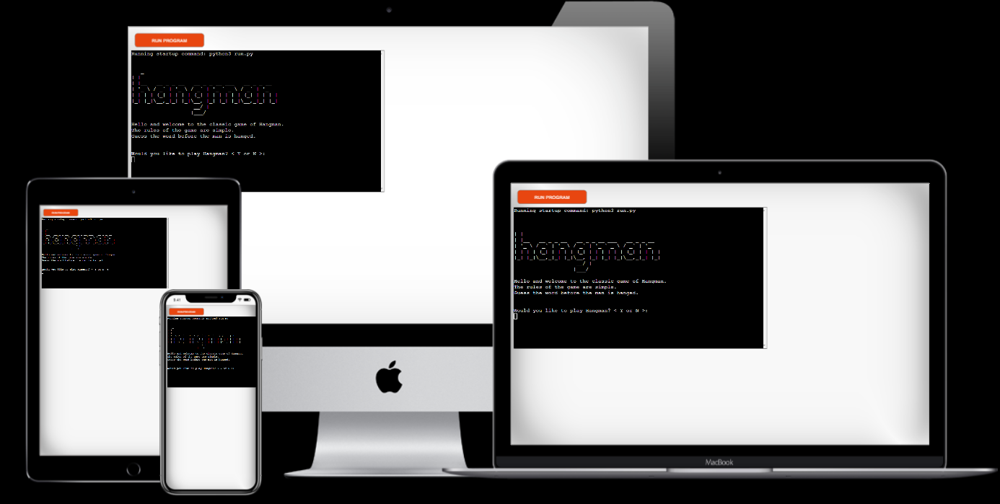
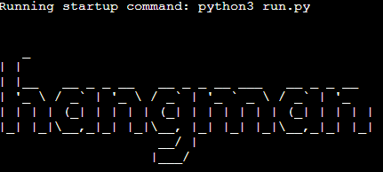
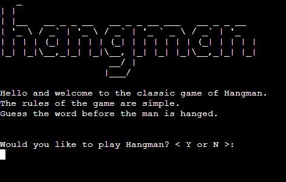
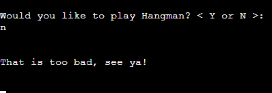

# Hangman

This is a small project written in Python. It is the classic game of Hangman. It is a simple word guessing game in which the user guesses the mystery word, letter-by-letter.

About Hangman -  [Hangman Wikipedia](https://en.wikipedia.org/wiki/Hangman_(game))

Link to the project -  [Hangman - The Game](https://game-of-hang-the-man.herokuapp.com/)

***

## Table of Contents
  * [UX and UI Design](#ux-and-ui-design)
    * [Owner Goals](#owner-goals)
    * [User Goals](#user-goals)
    * [Potential Features to Use](#potential-features-to-use)
    * [Wireframes](#wireframes)
    * [Flow Chart](#flowchart)
  * [Design](#design)
    * [Imagery](#imagery)
  * [Features](#features)
    * [Existing Features](#existing-features)
    * [Features Left To Implement](#features-left-to-implement)
    * [Technologies Used](#technologies-used)
  * [Testing](#testing)
    * [Validator Testing](#validator-testing)
    * [Manual Testing](#manual-testing)
    * [Accessibility](#accessibility)
    * [Bugs](#unfixed-bugs)
  * [Deployment](#deployment)
  * [Credits](#credits)
    * [Content](#content)
    * [Media](#media)
    * [Acknowledgments](#acknowledgements)

***

## UX and UI Design

UX and UI Design is limited due to the catch all design for terminal based projects. 

*** 

### Owner Goals

- To deploy a working game of Hangman that validates user input.
- To create a slight variation of the game. To allow for different degrees of difficulty.
- To challenge the user.

***

### User Goals

- Understand the game with ease.
- Option to chose the level of difficulty level of the game.
- Easy to user and navigate.

***

### Wireframes

Due to the game being played within the terminal, I did not use any design wireframes as the design is restricted to that of the terminal.

***

### Flowchart

FLOWCHART LOGIC

***

## Design

### Imagery

I used ASCII Art as the imagery within this project.

[ASCII Art Wikipedia](https://en.wikipedia.org/wiki/ASCII_art)

***

## Features

### Existing Features

#### Logo
  
  - The Logo is the word Hangman designed in ASCII Art

 
 ***

#### Menu
  
  - The Menu is loaded, with the logo, in the terminal.
  - It asks the user if they would like to the play the game or not.

***

#### End Game

 - If the user chooses not to play the game. Then we say goodbye to the user and the game will end.

***

#### Play Game

  - If the user chose to play the game, they are then asked if they would like to play with three, four, or a five lettered word.
  - The size of the word is repeated to the user.
  - Then the game begins, asking the user to guess a letter.

***

#### Coaches & Contact Us

  - This is to provide users with a quick look at who the coaches are at The English Football Club. It provides a profile photo, mobile contact, and email address.
  - On tablets and above, there is extra information regarding the coaches. This follows the styling of the 'About Us' section. Quick, bite-sized facts establishing the coaches credentials. Only profile photos, mobile and email contact details are visible for mobile devices. This is to provide the most important information to the user if accessing on a mobile. Also, if a user needs to get in contact with a coach, the information is present without any distracting information.
  - In keeping with the visual design of this website, the background image is zoomed in. Each coach information is separated within their own box stacked on top of each other. The opaque background allows the content to be visible as a text overlay of the image. Again, maintaining visual design patterns.

***

#### Prices

  - This section was kept simple. It is the continuation of the design pattern, using block colours which alternates with imagery as the user scrolls down the website.  
  - The attention is to draw the user directly to the price. That is why block colours were chosen. The prices are crystal clear and can be easily seen.
  - The football icon is a nice break up of the text, whilst also reinforcing the football content.
  - For mobile devices they stack vertically.

***

#### Training Times

  - This section is a continuation of the block colour and alternating imagery design pattern. 
  - This image used a background image, which is a birdseye view of a football match. I specifically wanted an image like this to represent this section. It is a fantastic backdrop for what the children will be playing on during the training sessions.
  - Like the 'Prices' section, the information is to the point. Dates, location, time and age group are clearly seen.
  - There is also a Google Map embedded, pinpointing the location of the training session for the user to plan how to get there.
  - Underneath there is a postal address with the the strong blue background. This was used to really show the information at hand, even if the user is glancing quickly. This was chosen to help the user find the address should they be travelling to the location for the first time. The address can be seen instantly, as we imagine stopping to input the information into a sat nav whilst driving can be a stressful situation!
  - For Mobile devices, the boxes stack vertically.

***

#### Footer

  - The footer matches the same design pattern as the navigation bar.
  - We chose simple logos, using the same styling, to continue the simple and minimalist feel.  
  - Each social media page opens up in a new tab. This is to give the user a good experience in accessing a different page, but remaining on our website a the same time.

***

#### Go To Top Button

  - As the main content of our website is a single-page scroll, I implemented a 'up' arrow to allow the user to return to the top of the website. The button is in the same font colour as the website, with the dark blue colour used for the logo. This is to allow the user to clearly see it at all times.
  - This was used instead of a sticky nav bar, as it is something slightly different. A sticky nav bar would clash with each section title. The background colour of the nav bar and each section is the same. This is to create a nice aesthetic. The sticky nav bar would confuse the user, as it could blend in with the section title.
  - This feature is only on tablet and above devices.

***

#### Sign Up Page

  - The Sign Up form is on a new page. This is to show the importance of the form. It deserves it's own page. After the user has scrolled the main page, they would have the information they seek about whether to sign their child up.
  - The background image is a fantastic image to be used on this page. It shows children standing around a coach with a clip-board and pen. The form is positioned over the image which give a great design juxtaposition.
  - The form is simple, and keeps in with the design colours of the main page, for a great user experience.
  - Form has several required fields. This is to ensure the website owners receive the correct information for the child to join their training sessions.
  - The mobile design uses the a block colour as the background. This is so the background image doesn't distract the user from the form. This was also used as a way to improve the loading speed for the website. With the image it only scored 73% on Lighthouse. To improve the user experience, I wanted at least 90% in all fields on all devices.

***

#### Submitted Form

  - I won't expect the user to stay long on this page. Hence the simple design of a background colour and font, which is in keeping with the style of the website.
  - The user wants to know we have received the form, and that they we welcome at training, therefore there are no visual distractions.

***

#### Error 404

  - I do not expect the user to stay on this page for long, nor should they! The page contains a link at the bottom with 'HERE!'. The letters are uppercase and underlined to exaggerate where the user has to click.
  - Failing that, the navigation bar remains at the top of the page, allowing the user to click on any of the established links to return back to the content pages of the website.

***

### Features Left To Implement

  Gallery of future tournaments/fun days. As the tournaments, and fun days, have not happened yet, they cannot be added onto the website. Once they have been, the gallery will use the Masonry design method.
  
***

## Technologies Used

Languages
  - [HTML5](https://en.wikipedia.org/wiki/HTML5)
  - [CSS](https://en.wikipedia.org/wiki/CSS)
  
Frameworks and Libraries
  - [Am I Responsive?](http://ami.responsivedesign.is/)
  - [Balsamiq](https://balsamiq.com/)
  - [Coolors.co](https://coolors.co/)
  - [Font Awesome](https://fontawesome.com/)
  - [GitBash](https://gitforwindows.org/)
  - [GitHub](https://github.com/)
  - [Google Dev Tools](https://developer.chrome.com/docs/devtools/)
  - [Google Fonts](https://fonts.google.com/)
  - [Pexels](https://www.pexels.com/)
  - [Responsive PX](http://www.responsivepx.com/)
  - [Slack](https://slack.com/intl/en-se/)
  - [TinyPNG](https://tinypng.com/)
  - [Unsplash](https://unsplash.com/)
  - [VS Code](https://code.visualstudio.com/)

***

## Testing

### Validator Testing

  HTML
    

      
'index.html' - Zero Errors

      
    

    

    
'sign-up.html' - Zero Errors

    
    

        

    
'form-submit.html' - Zero Errors

    
    

            

    
'404.html' - Zero Errors

    
    

  CSS
    

      
'styles.css' - Zero Errors

      
    

    

      
'styles.css' - 1 Warning

      
    

  This is due to importing Google Fonts onto the CSS stylesheet. The W3Schools Jigsaw Validator does not check imported style sheets.

***

### Manual Testing

The site was manually tested throughout production. This included ensuring 
   - All navigation links corresponded to the correct part of the website. 
   - The sign-up form had the necessary required attributes, ensuring all data needed was submitted.
     - The 'sign-up!' button directed to the correct page, telling the user that we had received their data.
   - A working Error 404 page, with a link directing the user back to the homepage.

Responsive testing was conducted on a Windows Laptop, iPhone 7, iPhone 7 plus, and a Samsung Galaxy Tab A8. As these devices are limited to their screen sizes. I also tested the responsiveness using Google Dev Tools and [Responsive PX](http://www.responsivepx.com/).

Testing was conducted on Google Chrome, Mozilla Firefox and Safari web browsers.

After website completion, I submitted the website to Code Institute's Slack Community, specifically the 'Peer-Code-Review' channel. 

***

### Accessibility

The website passes on all aspects of accessibility and colour contrast. 

Lighthouse Testing

  

  
'index.html' - Desktop

  
  

  

  
'index.html' - Mobile

  
  

  

  
'sign-up.html' - Desktop

  
  

  

  
'sign-up.html' - Mobile

  
  

  

  
'formsubmit.html' - Desktop

  
  

  

  
'formsubmit.html' - Mobile

  
  

  

  
'404.html' - Desktop

  
  

  

  
'404.html' - Mobile

  
  
  

 
Wave

  

  
'index.html'

  
  

  

  
'sign-up.html'

  
  
 

  

  
'form-submit.html'

  
  

  

  
'404.html'

  
  
  
  
***

### Bugs

I had a lot of issues with the Sign-Up Form. It took me a long time to come to a final solution of having a fully responsive form for all media devices.

- Bug 1 - Hero Image
  I had issues with my original hero image. Due to context of the image, and the pixel size, it created an off-balance look. It overcome this, I opted for a different hero image. Upon speaking with the test users and owners, they agreed that the new hero image was better for the overall story of the website.

- Bug 2 - Coaches & Contact Us
  I had issues with the content for each coach. I solved this by using Flexbox. I also opted to remove the coaches' facts on mobile devices. This is so contact information is clearly seen by the user. 

 - Bug 2 - Sign-Up Form
  Position: Relative' and 'Position: Absolute'. For Desktop and Tablets there was no issue. However, on mobile devices, the sign-up form was off the page, or loading over the footer. I solved this issue by removing the background image and using a background colour instead. This also help to dramatically increase the performance of on mobile devices. I also made a smaller font-size, and managed to move the Position: Absolute toward the left side.

 - Bug 3 - Navigation Bar
  I had issues regarding the navigation bar for mobile devices. I used Flexbox in order to create the nav bar, however, on a mobile device it looked too 'busy' with messy ordering. I opted to change the nav bar to a column on mobile devices. This was a better representation. Using two different iPhones, I was able to use the links without any difficulty. This could be a future bug, as I note that it was the Nav bar that hindered my 100% scores to mid 90s on Lighthouse. Going forward, I would like to implement a 'Hamburger' Nav bar for Mobile devices. Upon research, JavaScript is required for this. After immersing myself into JavaScript, this bug will be corrected, and as such achieve 100% on Lighthouse.

- Bug 4 - W3Schools Validator
  After running my code through the validator. It returned several 'typos' within the code itself. This included:
    - Unclosed Divs.
    - Divs within the Fieldset and Legend
    - 'Di' being typed instead of Divs.

***

## Deployment
  
  - The site was deployed to GitHub pages. The steps to deploy are as follows:
  - In the GitHub repository, navigate to the Settings tab
    - From the source section drop-down menu, select the Master Branch
    - Once the master branch has been selected, the page will be automatically refreshed with a detailed ribbon display to indicate the successful deployment.

- The link:
  - [The English Football Club - Website](https://totallysly.github.io/portfolio-project-one/)

***

## Credits
  
### Content

  All written content is purely fictional. I created the written content myself as the company is also fictional. 
  - The training section was inspired by a section of tutorial project, [Love Running](https://github.com/Code-Institute-Solutions/love-running-2.0-sourcecode/tree/main/05-meetup-times), via the Code Institute.
  - A lot of research was placed on [Stack Overflow](https://stackoverflow.com/), [W3Schools](https://www.w3schools.com/), [Mozilla Developer](https://developer.mozilla.org/en-US/)
  - I implemented a 'Scroll to Top Button' - [Scroll to Top Button](https://www.youtube.com/watch?v=Vef9bxTilCU&ab_channel=DarkCode)
  - Help with Code for the form [Form Code](https://dev.to/uma/responsive-form-using-html-and-css-4l59)
  - [Position Absolute and Relative](https://thoughtbot.com/blog/positioning#position)
  -  [CSS Tricks Guide to Flexbox](https://css-tricks.com/snippets/css/a-guide-to-flexbox)
  -  [Which CSS Units to Use?](https://gist.github.com/basham/2175a16ab7c60ce8e001)
  -  [Responsive Google Maps](https://blog.duda.co/responsive-google-maps-for-your-website)
  -  [Media Queries](https://stackoverflow.com/questions/6370690/media-queries-how-to-target-desktop-tablet-and-mobile)
  - In addition several YouTube videos:
      - [Web Dev Simplified](https://www.youtube.com/c/WebDevSimplified/playlists) (Flexbox, Absolute/Relative Position).
      - [Kevin Powell](https://www.youtube.com/kepowob). (Flexbox, Absolute/Relative Position)
      - [Minim](https://www.youtube.com/watch?v=VX_Dghv65Vk&list=PL4cTxE4s2XIYJL6uPQUwMt25M70gPl-O6&index=14&ab_channel=Minim). (Sign-Up form).
  - The README Template was a mix of Code Institute's README Template for [Love Running](https://github.com/Code-Institute-Solutions/readme-template) and the excellent website and README by [Aofie Smith](https://github.com/aoifesmith/evanandanna/blob/main/README.md)

  - Icons where via the amazing website - [Font Awesome](https://fontawesome.com/).
  - The colour palette was from [Coolors](https://coolors.co/)
  - Additional Responsive Tool [Responsive PX](http://www.responsivepx.com/)
  - And of course, Google Dev Tools.

***

### Media

  - My images were from two stock image websites: [Pexels](https://www.pexels.com/) and [Unsplash](https://unsplash.com/).

 - Hero Image [Pixabay](https://www.pexels.com/@pixabay)
 - Coaches Background Image [Ralph (Ravi) Kayden](https://unsplash.com/@ralphkayden?utm_source=unsplash&utm_medium=referral&utm_content=creditCopyText)
- Coach Richards Image [Midas Hofstra](https://unsplash.com/@midashofstra)
- Coach Edwards Image [Ben Den Engelsen](https://unsplash.com/@benjeeeman)
- Training Times Image [Mike](https://www.pexels.com/@mike-468229)
- Sign-Up Background Image [Kampus](https://www.pexels.com/@kampus)
  
***

### Acknowledgements

I would like to thank my Code Institute mentor Antonija Simic for her help and guidance during this project.

I would like to thank the Code Institute Slack community for all their support and help with various general questions I have asked thus far. Specifically to David_Bowers5p and Aoife Smith_5p for their Peer-Code-Review feedback, and Eventyret_Mentor for answering a lot of my questions. 

***